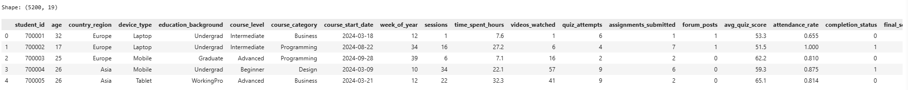
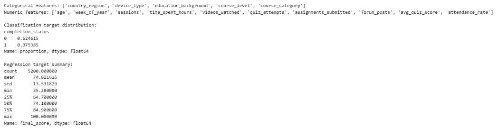
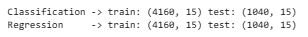
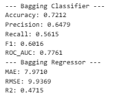
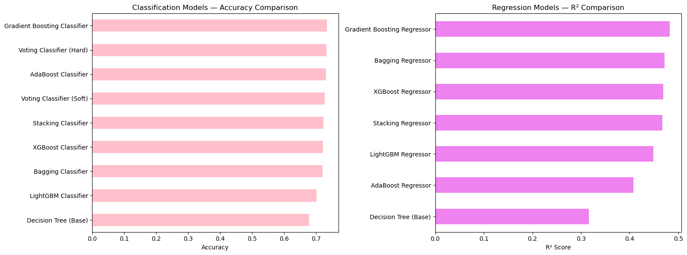
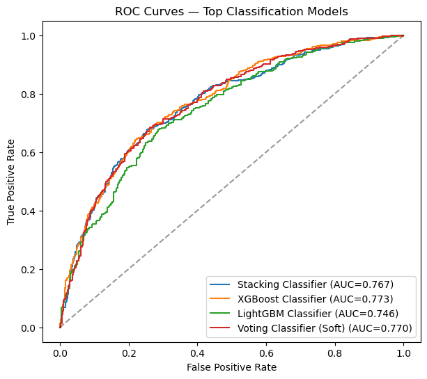
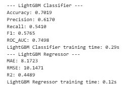
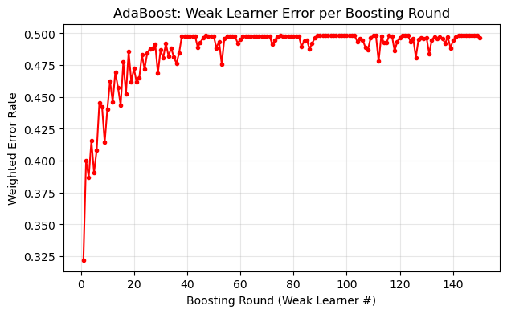
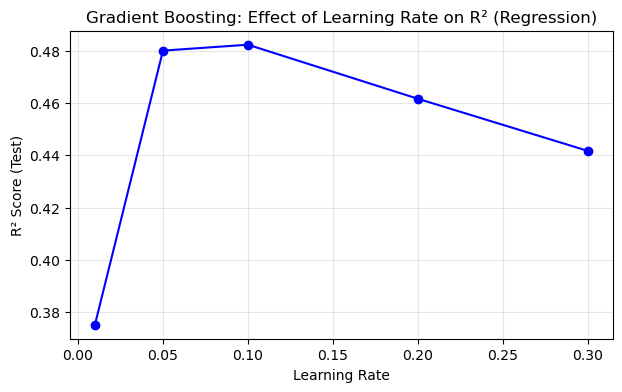
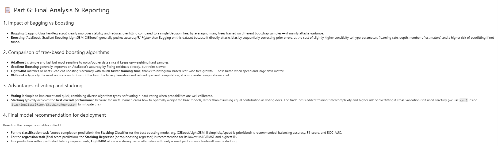

# 📚 Smart Outcome Predictor

## 🎯 Predict Student Course Completion & Final Score using Bagging, Boosting and Ensemble Machine Learning


------------------------------------------------------------------------

# 🌟 Project Overview

Smart Outcome Predictor is an end-to-end Machine Learning project that
predicts:

-   ✅ Student Course Completion (Classification)
-   ✅ Student Final Score (Regression)

using Decision Tree, Bagging, AdaBoost, Gradient Boosting, XGBoost,
LightGBM, Voting, and Stacking ensembles.

------------------------------------------------------------------------

# ✨ Features

-   ✔ Data Cleaning & Preprocessing
-   ✔ Feature Engineering
-   ✔ Classification & Regression Pipelines
-   ✔ Bagging & Boosting
-   ✔ Voting & Stacking
-   ✔ ROC Curve Analysis
-   ✔ Model Comparison
-   ✔ Final Deployment Recommendation

------------------------------------------------------------------------

# 📂 Dataset

-   **Rows:** 5,200
-   **Features:** 19
-   **Classification Target:** `completion_status`
-   **Regression Target:** `final_score`

------------------------------------------------------------------------

# 🛠 Technologies

-   Python
-   Pandas
-   NumPy
-   Matplotlib
-   Scikit-Learn
-   XGBoost
-   LightGBM

------------------------------------------------------------------------

# 📊 Model Performance

## Classification

  Model                        Accuracy
  ------------------- -----------------
  Decision Tree                   67.9%
  LightGBM                        70.2%
  Bagging                         72.1%
  AdaBoost                        73.2%
  Gradient Boosting           **73.4%**
  XGBoost                         72.2%
  Voting                          72.8%
  Stacking              ⭐ Best Overall

## Regression

  Model                        R² Score
  ------------------- -----------------
  Decision Tree                   0.315
  AdaBoost                        0.407
  LightGBM                        0.449
  XGBoost                         0.469
  Bagging                         0.472
  Gradient Boosting           **0.482**
  Stacking              ⭐ Best Overall

------------------------------------------------------------------------

# 📷 Screenshots

> Create a `screenshots/` folder in your repository and place these
> images inside it.

``` text
screenshots/
├── dataset_preview.png
├── dataset_info.pnn
├── tts.png
├── bagging_results.png
├── boosting.png
├── models_comparison.png
├── roc_curve.png
├── light_gbm.png
├── adaboost.png
├── gradientboost.png
└── final_analysis.png
```

Example:
























------------------------------------------------------------------------

# 📌 Key Findings

-   📈 Gradient Boosting achieved the best standalone performance.
-   🚀 Stacking Ensemble delivered the highest overall accuracy.
-   ⚡ LightGBM provided an excellent speed-performance balance.
-   🎯 Bagging reduced variance and improved stability.

------------------------------------------------------------------------

# 👨‍💻 Author

**Badshaa**

🎓 Final Year Computer Engineering Student

⭐ If you like this project, give it a star!
